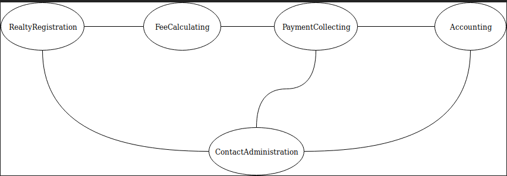

# Context Mapping

{.alert .alert-info}
Instead of giving an introduction about context mapping myself I think it's better to link
to existing sources. That said, please read the [Strategic Domain Driven Design with Context Mapping](https://www.infoq.com/articles/ddd-contextmapping){: class="alert-link"}
article on InfoQ.

We need to gather information about the company's structure as well as the system landscape.
Therefor I've asked a few questions and @enumag answered them:

**Where do you get the data from?**

> When possible the data are imported from a file (let's say XML) or from an external database. When not possible they are added in manually by our employees.
>
> Later modifications are all done manually as far as I know.

**Who is responsible for the data?**

> Our emloyees, although I'm not sure if that's what you're asking.

**How often does the data change?**

> Not too often. Usually just when an apartment is sold. Other than that people can report changes in their contacts, addresses etc.

**What data changes influence the fee generation process and how?**

> Any change on FeeRecipe and any change on ApartmentAttributeValue. Possibly something on Apartment but that should be all.

> Change on FeeRecipe usually means change to the formula to calculate the fee. Change on ApartmentAttributeValue means a change to the variables used in that formula. We're using Symfony/ExpressionLanguage to calculate the actual fee amounts from this data.

**Which departments of your company work with the system and what specific part do they use or are responsible for?**

**Is only one developer team working on the software or do you have multiple teams? If so, who works on which part?**

**Do you integrate with third-party services or provide an API for foreign systems?**

> The company is not too large so 1 dev team, couple of employees who work with the system, each taking care of a few buildings. We will surely integrate with 3rd party APIs to import some data and the plan is to also provide our own API in the future - that's why the backend is GraphQL application with frontend being a JS client running in the browser.

## Rinse And Repeat

The context map we are drawing is not a final thing. Whenever new concepts arise for example integration of external systems, growing company, new software modules ....
You have to revisit the context map and check if it needs to be aligned. Same is true for the implementation itself.
Hence, we start with a modularized monolith and only turn modules into independent (micro)services if we are:

a) relatively sure the context boundary is right and
b) need to scale that module

## First Map

For now a simple context map is all we need because only one team is working on the system and the company structure is also relatively flat with
a few people working with the system.

## Considerations

### RealtyRegistration

Adding a realty and all the details about the apartments and people is the first thing you need to do in the system. It can be done manually or by some import. It made sense to separate this from the rest of the logic in the system.

With that said the border between RealtyRegistration and FeeCalculating is really unclear for now.

### FeeCalculating

This context is supposed take care of the second part where we need to generate the fees every month.

The main struggle here is that to generate those fees we need some data from RealtyRegistration so we're unsure if those data should be in RealtyRegistration or in FeeCalculating or somehow in both. I'm mainly talking about the ApatrmentAttributeValues (such as body count and area). This is the weakest point in the current structure.

### PaymentCollecting

We need to collect payments from multiple sources (files, external APIs, manual registration) so again we wanted to separate this from the rest.

But then, as you know, we need to allocate the payments to generated fees so it's unclear what's correct here.

### Accounting

At the moment this BC only contains AccountingOrganization. It feels empty to be honest but putting this aggregate inside PaymentCollecting doesn't feel right either because it will also be needed for other things than payments. Again this is one of the weak points in the current structure and most likely it's wrong.

### ContactAdministration

This one I'm quite satisfied with for now. It separates the contact information from everything else since each contact can be used for several different purposes.

One thing I'm note quite sure about here is how to handle deletion because you should not be able to delete a contact that is used somewhere else. But this BC doesn't know if a contact is used and where. Should it be aware of it or not?

### FeeRecipe

FeeRecipe is not a bounded context. It's an aggregate inside FeeCalculating bounded context.

## Context Relationships

### RealtyRegistration - FeeCalculating
FeeCalculating needs some data from RealtyRegistration to perform its tasks.

### FeeCalculating - PaymentCollecting
Fees and Payments need to be allocated to each other.

### PaymentCollecting - Accounting
Each entity in PaymentCollecting belongs to one AccountingOrganization. I've explained the reason why AccountingOrganization is separate above.

### ContactAdministration - RealtyRegistration
Each building has several employees of our company assigned to it. Those employees are taking care of whatever is needed to be done regarding that building.

### ContactAdministration - PaymentCollecting
Each payment needs to be assigned to the person who paid it. Or more exactly to a FinancialAccountGroup that belongs to that person. Each FinancialAccountGroup holds an id of a ContactCard.

### ContactAdministration - Accounting
AccountingOrganization is a corporate body and as such it holds id of a ContactCard that holds the information about it.

*With a first context map in place we can move on and use event storming to dive deeper into the domain, verify our context boundaries and get an idea of the model. Head over to the next page for more.*