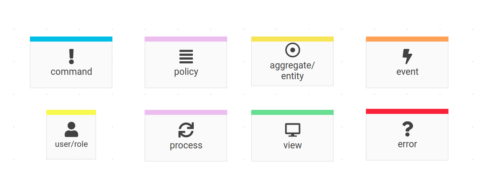

# Event Storming

We already learned a lot about the Fee Office. What's missing is a better understanding of the processes.

**What happens when?**

**What are the preconditions for certain actions?**

**How does the happy path look like?**

**And do we need to take care of some unhappy paths as well?**

{.alert .alert-info}
Many questions, right? Fortunately, [@ziobrando](https://github.com/ziobrando){: class="alert-link"} has developed a flexible workshop format
called [EventStorming](https://www.eventstorming.com/resources/){: class="alert-link"}. Follow the link for a comprehensive list of resources.

## Basics

EventStorming is really easy to learn and all sessions I did myself had amazing results. I can only recommend to read about it, watch a few presentations,
buy the book [Introducing EventStorming](https://www.eventstorming.com/book/) by Alberto Brandolini (@ziobrando) and actually try it with your team and domain experts.

For the Fee Office we started simple again. EventStorming works best with all people in one room and unlimited modeling space.
However, we tried remote EventStorming using a [realtimeboard](https://realtimeboard.com/app/board/o9J_kzYG5GQ=/).
Obviously, you can't achieve the same quality results in a remote session, especially when communication happens asynchronous via chat (or github issue in our case).

But it's still a great way for collaboration and for sharing ideas. Here are the basic colors for different types of sticky notes:

With this basic set of colors we just started modeling. The first sticky note is the most difficult one. Like the name suggests EventStorming
puts the focus on events or more precise on domain events. I've asked @enumag to put a few high level events on the board.
Here is the result:

That's a really good way to start. Now you can ask questions related to each of those events and zoom into the processes centered around them.
I asked the following two questions:

1. Who adds those fee recipes?
2. What happens if a fee recipe has a mistake?

And the board got a massive update:

> There are some nuances about what to do with already generated incorrect fees. I tried to added some notes to the board regarding that. Hopefully that should answer your questions. I tried to use the color scheme from your comment above (+ I added light green for conditions).
>
>  There is one new thing for you here - "accounted for fees". Usually in april we need to wrap up the previous year. When that happens some documents are created and most actions are no longer available with the payments and fees for that year (and they become "accounted for"). We didn't delve too deep into that just yet - we have other things to solve before that.
>
>  There is one thing though about the notes I just added to the board. While these actions are needed to fix incorrect fee recipes, they are not specific to that process. It's just some tools the building referent (employee of our company who works with the system) needs to have at their disposal. For example unallocating and reallocating payments is also done when we discover some old payment that was not added into the system because of a mistake. So while I added the notes close to fee recipe addition for now, it doesn't really feel correct to have it that way. How should things like that be represented on the board?

{.alert .alert-success}
Do you recognize what happened? Two simple questions brought up completely new knowledge: **accounted for fees** as well as a new important term:
**building referent** that we can add to the Ubiquitous Language and use in further discussions. That's the power of EventStorming. You gain a lot of knowledge about the domain
in a very short period of time.

Given the new information I asked the next questions:

3. I guess unallocating and reallocating payments is also done when an ApartementAttributeValue is wrong?

> After checking with my teammates I found out it works differently. It's not necessary to change the old fees in this case because the difference will be calculated with when we wrap up the year the next april. Basically it doesn't matter if the people paid something wrong, it will all be fixed in this yearly audit but we don't need to actually change the old fees in most cases.

4. Is there some kind of "monthly deadline" for building referents *(note how I use the newly learned term here)* until ApartmentAttributes changes should be made, so that the automated fee generation process can work with a fixed set of information?

> No because there is no way to tell if we received all the changes or if there even were any changes. I'll double check with my colleagues though.

And of course we added new sticky notes to the board:

{.alert .alert-info}
You might notice that two notes are a copy of already existing notes. The "developer DRY thinking" isn't really useful for EventStorming. Use the same notes as often as needed.
Move them around, rearrange and try different grouping. It is much cheaper to move stickies around and develop an idea of the system on the wall than starting to write code
just to realize two weeks later that your assumptions were wrong!

**We got a lot of domain knowledge. Now it's time for the first development iteration. We'll start with a prototype. Head over to the next page for details.**
