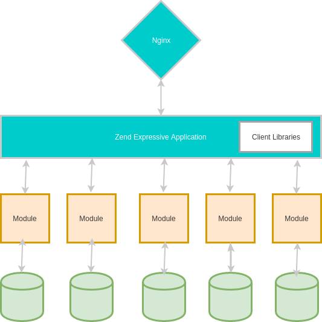
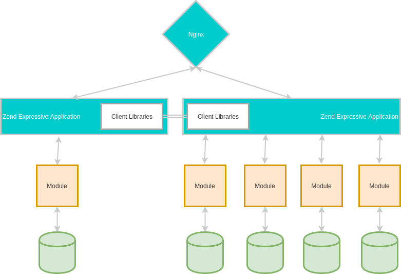

# Autonomous Modules

The Fee Office is split into 5 bounded contexts. Each context is represented as a software module in
our system. But we don't use a monolithic MVC module approach like you know from ZendFramework 2 modules or Symfony bundles.
Instead we use the lightweight [module system](https://docs.zendframework.com/zend-expressive/v3/features/modular-applications/)
provided by Zend Expressive.

{.alert .alert-info}
The technique used in the demo is not bound to zend expressive. We've picked it because expressive uses
PSR standards and has a module system that works the way we need it. Anyway, you can achieve the same
project structure using any existing PHP framework and composer. We recommend asking the respective framework
community if you're not sure how to do it with your framework of choice.

## The Rules

{.alert .alert-warning}
Each module should be completely independent of any other module even if all modules are deployed on the same server.

To achieve module autonomy we use a special set up. It is a combination of Expressive modules which are also composer packages.
More on that in a minute. Furthermore, an application layer acts as the glue layer to coordinate communication between users/clients and modules
as well as between the modules "talking" to each other.

1. Each module has its own URL root path, f.e. the *RealtyRegistration* module uses the path `/realty/...`.
2. Each module has its own `composer.json` and only uses dependencies defined in that `composer.json` OR provided by the application layer.
3. Each module has at least a dedicated database schema assigned to it, if not its own database(s).
4. No module is allowed to use a class or function defined in another module.

The following diagram illustrates the architecture:



If we later want to deploy one or more modules separated from the others (turn a module into a microservice), we can "easily" do that by deploying
the module together with the application layer and globally defined dependencies provided by the application layer.



## Application Layer

We've installed the [zend/expressive-skeleton](https://github.com/zendframework/zend-expressive-skeleton) with [Fastroute](https://github.com/nikic/FastRoute),
[zend/servicemanager](https://github.com/zendframework/zend-servicemanager), no template engine and the [Whoops](https://github.com/filp/whoops) error handler.
We've also enabled the module system of expressive.

The application layer takes over a few tasks:

1. It uses the [zend-component-installer](https://github.com/zendframework/zend-component-installer) to install our modules.
The installer is a composer plugin registered in the root `composer.json` of the application layer.
2. It merges module config and provides env vars via `app.env`
3. It performs routing of http requests using Fastroute
4. It provides an error handler (Whoops) and could also include authentication and authorization (not included in the demo)
5. It provides client libraries available for all modules, f.e. a logger, a service bus + basic message classes, etc.

The application layer uses the `App` namespace.

## Modules

A module has its own namespace. For example the *RealtyRegistration* module uses the namespace `FeeOffice\RealtyRegistration`.
The namespace maps to the path `src/RealtyRegistration/src`.

A module also has its own `composer.json` where all dependencies of the module should be defined.

{.alert .alert-danger}
A module is not allowed to use dependencies that are not defined in its own composer.json. The only exception are global dependencies (client libraries)
provided or imported by the application layer. At the moment this is a convention and needs to be ensured by code reviews. In the future we might
add a tool that performs automated code scans to ensure that rule.

In the application's root `composer.json` each module is included as local package:

```json
"repositories": [
        {
            "type": "path",
            "url": "src/RealtyRegistration"
        }
    ],
    "require": {
        "php": "^7.1",
        "feeoffice/realty-registration": "*",
```
*Example of importing the RealtyRegistration module as package in the root composer.json*

We use composer to manage module dependencies and add the module namespace to the autoloader. That said, each module can require its own dependencies
but as long as modules are deployed together, composer makes sure that different dependency versions don't conflict with each other.

{.alert .alert-info}
Defining module dependencies per module makes it much easier to deploy them independently later.

Each module has a [config provider](https://github.com/mtymek/expressive-config-manager#config-providers) and the `zend-component-installer` composer plugin
automatically adds each config provider to the `expressive config manager` of the application layer. This way, modules provide their own
routing and middleware pipe configuration as well as module specific DI definitions.

{.alert .alert-success}
Clean and nice separation of concern which makes it very easy
to build a true modularized application with the option to turn it into microservices if needed.

*That's enough technical detail for now. On the next page you'll get a first overview of the domain.*


