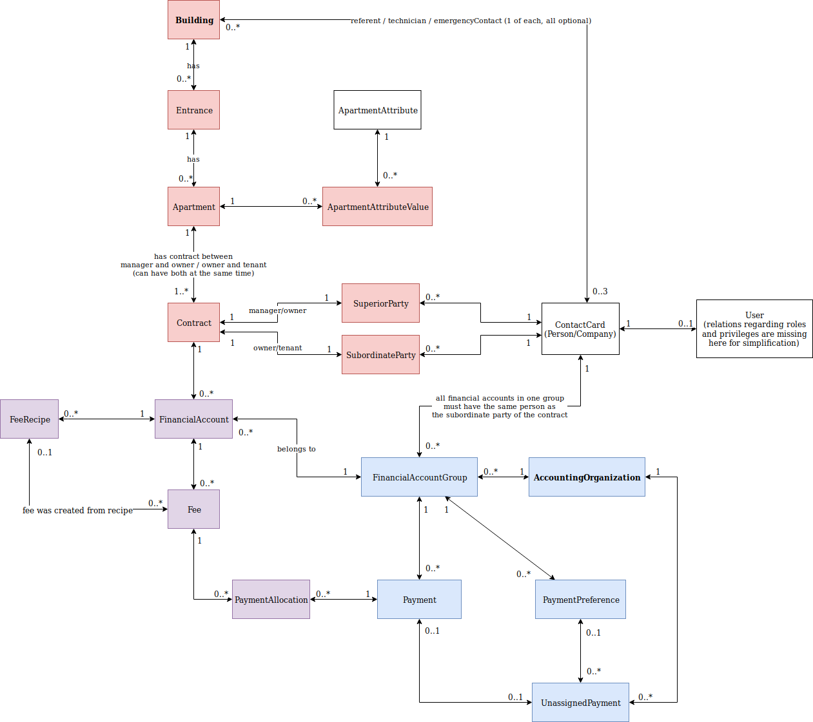

# The Domain

As stated in the introduction, the Fee Office is based on an "es-emergency-call" and therefor
represents the prototype implementation of a real domain.

What follows is an introduction of the problem space given by [@enumag](https://github.com/enumag):

> The business is about providing accountancy services to the owners of large buildings or organizations that take care of the building when each apartment is owned by a different person.
>
> First let's say the database is empty so we need to add some data. The first thing to add is a building, it's entrances (each entrance has a different address) and the apartments in the building. Then we need to add the contracts - who owns and who lives in each apartment. These people need to pay some fees every months which is where our company comes in - to help determine what fees they should pay and observe if they are indeed paying them. When adding a new building, most of the data about apartments, contracts and people are loaded from an external database or an import file.
>
> Next we need to tell the system what fees should the people pay and how to calculate the exact amounts (since they can differ each month but can be calculated). This is represented by the FeeRecipe entity. Each contract usually has around 5-10 FeeRecipes. As you can see in the diagram there is a FinancialAccount entity between Contract and FeeRecipe. Most often each contract only has one FinancialAccount but in some edge cases there can be more. This is required because the Fees on different FinancialAccounts are treated a bit differently in some cases based on the attributes of the FinancialAccount but the details are unimportant.

> In the draw.io representation I went for something close to an UML diagram, but focusing just on the relations. The diagram represents what a relational schema would look like - in fact this is pretty much what our PostgreSQL projection looks like. I did cut a few less important things here and there such as that each ContactCard hold some addresses, phones, emails etc - these details are not important for this issue in my opinion.
>
> At the end of each month an automated process takes each (still active) FeeRecipe and generates a new Fee for it for that month. The calculation requires the formula from the FeeRecipe and the current ApartmentAttributeValues on the related Appartment. ApartmentAttributes are properties of the apartment such as bodycount (how many people live in the apartment at the time) which can change every now and then. Each change is represented by a new ApartmentAttributeValue.
>
> Next looking from the other side of the diagram there is an AccountingOrganization. In most cases an AccountingOrganizations is 1:1 with Building but there are exceptions with one AccountingOrganization handling multiple buildings and also exceptions with one building being split to multiple AccountingOrganizations. Therefore we made them completely independent.
>
> FinancialAccountGroup is actually a brand new entity we came up with just this morning after discovering some serious problems in our PaymentAllocations process. Basically it's a group of FinancialAccounts that holds some options how should the Payments be allocated to Fees. FinancialAccountGroup is actually the scope for the PaymentAllocations process - take all not-fully-allocated Payments and FeeItems related to the FinancialAccountGroup and do the process described in the previous issue.
>
> PaymentPreference holds a reference number that we can use to match a given payment from the import to a specific person and FinancialAccountGroup. The process of matching imported payments to people converts UnassignedPayment to Payment.
>
> Finally the ContactCard represents a Person or Company and can be referenced pretty much anywhere in the system. It can be an employee of our company, an owner of an apartment, an organization managing a building, a contractor our company cooperates with etc.

{.alert .alert-warning}
That's a lot of information, isn't it? The team has some struggle with identifying the "right" bounded contexts and aggregates.
@enumag summarizes it like this:

> Our struggle mostly comes down to the uncertainty of "how big should an aggregate be" - where the answer is of course "it depends" but I'm unsure "what exactly it depends on". Should each of the entities in the diagram be an aggregate? If not then how far should one aggregate go? Is there some limit to how much data should an aggregate hold or how many different methods, related commands and events it should have? For now most of the things on the diagram are actually aggregates (with a few more aggregates planned to oversee the automated processes) with the structure being split to around 5 bounded contexts. Is that too many?
>
> Another problem is that some parts of the structure are pretty much pure CRUD - Building, Entrance, Apartment, ApartmentAttributeValue, Contract, FinancialAccount, FeeRecipe, ContactCard - all of that is pretty pure CRUD, albait some parts are automated with imports. The reason why we chose to use DDD are the processes around generating fees, finding out which payment was payed by who and which payment pays which fees (the last process is explained a bit more in #6). Also having the entire event sourced history will be beneficial in some of the processes and also other parts that are not yet represented on the diagram (such as calculating penalties for late payments). This puts us in a not very good position where we need to deal with CRUD in ES/CQRS while knowing that ES/CQRS is not really the best thing for CRUD.

{.alert .alert-warning}
Two common problems for teams using DDD, CQRS and Event Sourcing for the first time. Let's see if we can help the team with some guidance and a prototype
of a modularized application with each module representing a bounded context of the domain.

*On the next page we'll sort the information given above and take a first look at the bounded contexts.*